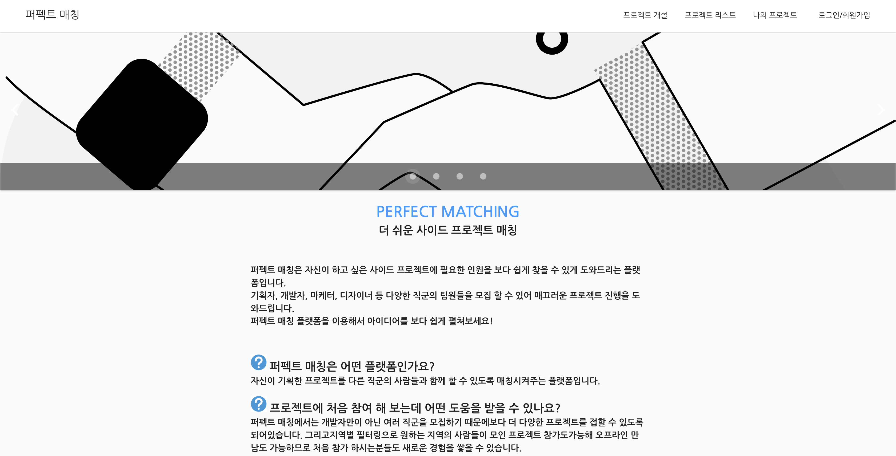

# 퍼펙트 매칭 프론트엔드 레포지토리(perfectmatching-frontend)

사용자가 원하는대로 사이드 프로젝트를 함께할 팀원들을 모집할 수 있고 또는 사용자가 원하는 사이드 프로젝트에 참여하기 위해서 프로젝트를 찾을 수 있는 매칭 플랫폼 프로젝트.

## 개발 환경

| TYPE      | SPEC                 |
| --------- | -------------------- |
| OS        | Mac OS, Windows 10   |
| Vue.js    | v3.9.3               |
| yarn      | v1.16.0              |
| Node.js   | v10.15.3             |
| ESlint    | Standard for vue-cli |
| Test Tool | Jest                 |

## Project setup

```
yarn install
```

### Compiles and hot-reloads for development

```
yarn run serve
```

### Compiles and minifies for production

```
yarn run build
```

### Run your tests

```
yarn run test
```

### Lints and fixes files

```
yarn run lint
```

### Run your unit tests

```
yarn run test:unit
```

### Customize configuration

See [Configuration Reference](https://cli.vuejs.org/config/).

## 진행상황

### 와이어 프레임

- [각 페이지 와이어프레임](./References/wireframe.md)

### 중간 발표
- [URL](https://www.youtube.com/watch?v=Z-qjY1SGmF8)

### <del>배포 주소</del>(배포 중단)

- <del>[테스트 보러가기](https://perfectmatching.netlify.com/)</del>

### 구동 화면



<br>


### URL 명세

<details>

<summary>접기/펼치기 버튼</summary>

| URL                       | 페이지 이름                                                                         |
| ------------------------- | ----------------------------------------------------------------------------------- |
| /home                     | [메인 페이지](https://perfectmatching.netlify.com/home)                             |
| /join                     | [가입 페이지](https://perfectmatching.netlify.com/join)                             |
| /projects                 | [프로젝트 리스트](https://perfectmatching.netlify.com/projects)                     |
| /project/:idx             | [프로젝트 상세페이지](https://perfectmatching.netlify.com/project/1)                |
| /project/:idx/application | [프로젝트 지원페이지](https://perfectmatching.netlify.com/projects/1/application)   |
| /new/project              | [프로젝트 개설페이지](https://perfectmatching.netlify.com/new/project)              |
| /my                       | [마이페이지](https://perfectmatching.netlify.com/my)                                |
| /my/edit                  | [정보 수정페이지](https://perfectmatching.netlify.com/my/edit)                      |
| /my/projects              | [나의 프로젝트 페이지](https://perfectmatching.netlify.com/my/projects)             |
| /my/projects/:idx         | [프로젝트 관리 페이지](https://perfectmatching.netlify.com/my/projects/1)           |
| /my/projects/:idx/edit    | [프로젝트 수정 페이지](https://perfectmatching.netlify.com/my/projects/1/edit)      |
| /my/projects/:idx/done    | [프로젝트 완료 폼 페이지](https://perfectmatching.netlify.com/my/projects/1/done)   |
| /new/done                 | [진행했던 프로젝트 추가 페이지](https://perfectmatching.netlify.com/new/done)       |
| /my/done/:idx/edit        | [진행했던 프로젝트 수정 페이지](https://perfectmatching.netlify.com/my/done/1/edit) |
| /profile/:idx             | [유저 상세페이지](https://perfectmatching.netlify.com/profile/1)                    |

</details>

---

## Git 컨벤션

<details><summary>접기/펼치기 버튼</summary>

### 공통사항

- 프론트, 백엔드 각각 레포지토리를 따로 만들어 개발을 진행합니다.
  - 협업 flow 방식은 프론트, 백엔드 레포지토리를 따로 만들어 협업하는 사람들 끼리 원하는 방식을 정해 사용합니다.
- 프론트, 백엔드가 서로 의견 나눌 사항이 있으면 레포지토리 issue에 남깁니다. ex) 이슈, 제안, 어떠한 사항이든

### 프론트엔드 레포지토리

- 공용 레포지토리를 fork하여 fork한 레포지토리에서 개발을 진행합니다.
- 개발할 내용을 issue에 등록을 합니다.
- issue 등록한 내용을 기준으로 개발을 진행하고 진행중이라면 project 탭에서 해당 이슈를 Doing 컬럼에 넣어 어떤 작업을 하고 있는 중인지 알려주어야 합니다.
- 개발이 끝난 이슈는 close 하며, project탭의 카드도 done으로 이동시킵니다.
- `모든 개발`은 `dev` 브랜치에서 개발을 진행합니다.
- `배포를 할 때`는 dev브랜치의 내용을 `master` 브랜치에 병합합니다. master 브랜치를 배포용 브랜치로 사용을 합니다.
- commit 방식은 `동사: 대상파일, 내용` 형태로 작성합니다.

  ```bash
  git commit -m "Update: HomeView, add login button"
  git commit -m "Add: LoginModal.vue"
  ```

  </details>

---
